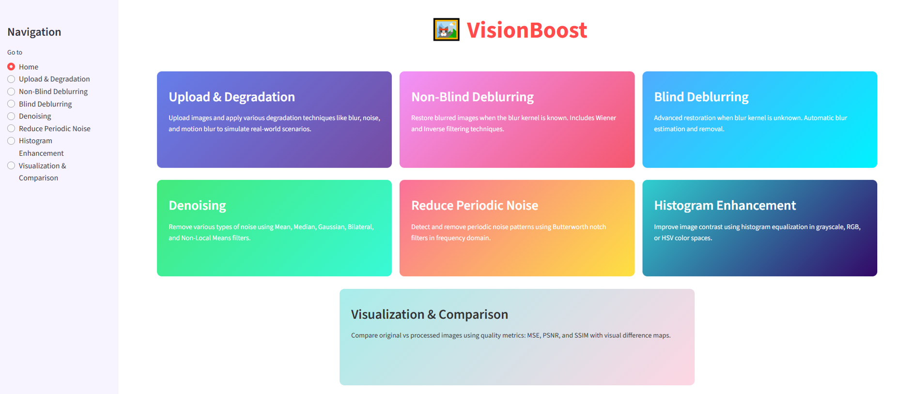
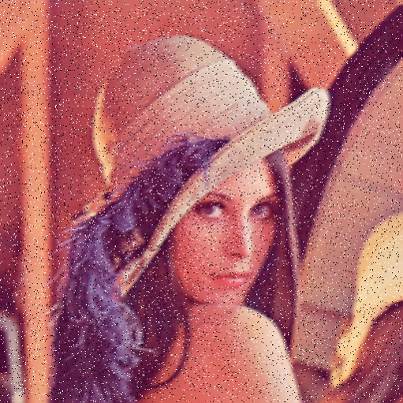
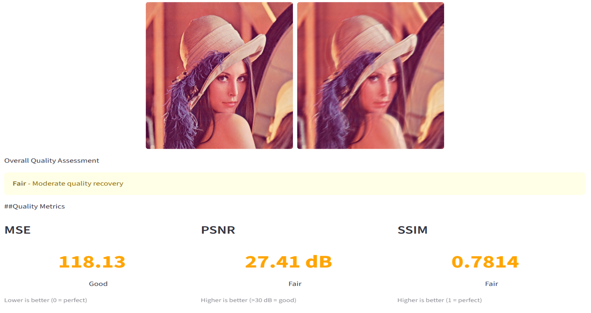

# VisionBoost: Non-Blind Image Deblurring and Denoising

VisionBoost is a Streamlit-based image restoration application that enhances degraded images by removing **motion blur** and **noise**. The project implements classical image restoration techniques, including **Wiener Filtering** and **Richardson–Lucy Deconvolution**, to recover high-quality images from known degradation models.

---

## 📌 Features

- Motion blur simulation using customizable PSF (Point Spread Function)
- Gaussian and Salt & Pepper noise generation
- Wiener Filter for image restoration
- Richardson–Lucy Deconvolution
- Side-by-side comparison of degraded and restored images
- Interactive Streamlit web interface
- Adjustable blur and noise parameters

---

## 🛠️ Technologies Used

- Python
- Streamlit
- OpenCV
- NumPy
- SciPy
- scikit-image
- Matplotlib

---

## 📂 Project Structure

```text
VisionBoost/
│── app.py
│── utils/
│── images/
│── outputs/
│── requirements.txt
│── README.md
```

---

## ⚙️ Image Restoration Pipeline

1. Upload an image.
2. Apply motion blur using a known PSF.
3. Add Gaussian or Salt & Pepper noise.
4. Restore the degraded image using:
   - Wiener Filtering
   - Richardson–Lucy Deconvolution
5. Compare the restored image with the original.

---

## 📸 Screenshots

### Home Interface



---

### Motion Blur Generation


---

### Noise Addition



---

### Wiener Filter Result


---

### Richardson–Lucy Result


---

### Comparison



---

## 🚀 Installation

Clone the repository:

```bash
git clone https://github.com/yourusername/VisionBoost.git
cd VisionBoost
```

Install dependencies:

```bash
pip install -r requirements.txt
```

Run the application:

```bash
streamlit run app.py
```

---

## 📊 Algorithms Implemented

- Motion Blur (PSF)
- Gaussian Noise
- Salt & Pepper Noise
- Wiener Filtering
- Richardson–Lucy Deconvolution

---

## 🎯 Learning Outcomes

This project demonstrates:

- Image degradation modeling
- Frequency-domain image restoration
- Deconvolution techniques
- Digital image processing fundamentals
- Interactive application development with Streamlit

---

## 👨‍💻 Author

**Choyan Mitra Barua Bijoy**

Bachelor of Science in Computer Science and Engineering

Khulna University of Engineering & Technology (KUET)

GitHub: https://github.com/VE-NOM101

LinkedIn: https://www.linkedin.com/in/choyan-mitra-barua-bijoy

---
⭐ If you found this project helpful, consider giving it a **Star** on GitHub.
